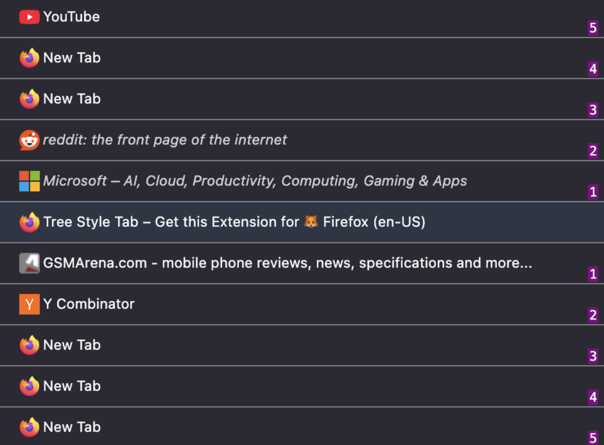

# Tree Style Tabs (TST) Relative Tab Count

Displays labels in the Tree Style Tab sidebar showing the distance (in tabs) from the active tab, for the 50 tabs before and after it. Automatically updates when switching tabs. Designed to complement Vim-style navigation extensions like Vimium and Tridactyl. 

